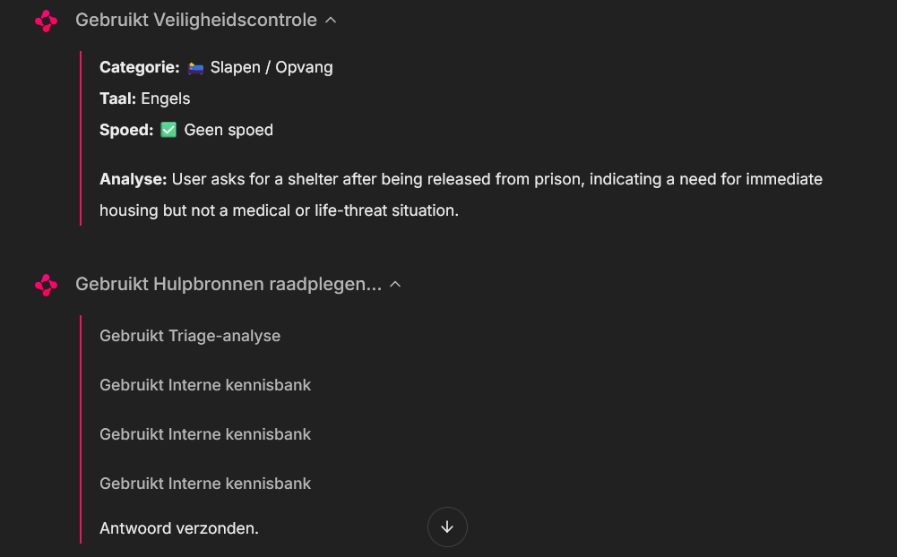
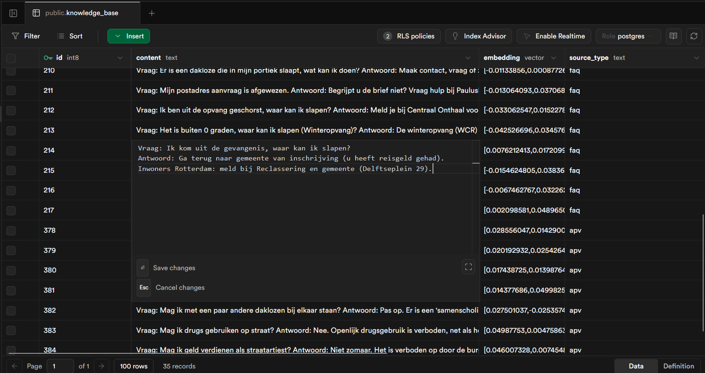
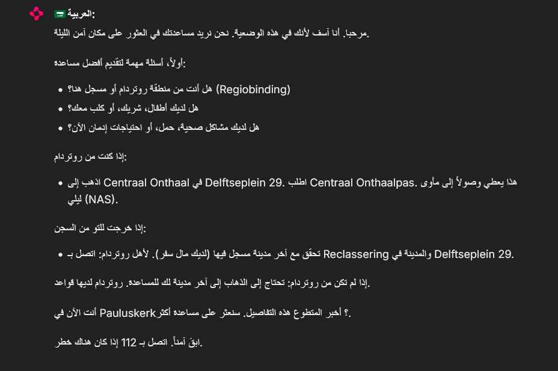

# RotterMaatje

> **[Project Report: Informatievoorziening voor hulpverleners bij de Pauluskerk](docs/Informatievoorziening%20voor%20hulpverleners%20bij%20de%20Pauluskerk.md)**  
> Full project report (Dutch): covers problem analysis, methodology, architecture decisions, and evaluation.

## Description
This project implements an AI-powered triage and information chatbot designed to assist volunteers at the Pauluskerk in Rotterdam. It uses a multi-agent architecture with Retrieval-Augmented Generation (RAG) to provide accurate, real-time information on shelter, food, and medical services for homeless individuals. The system features a dedicated safety triage agent, a vector-based knowledge retrieval pipeline, and supports multilingual interactions in Dutch, English, Polish, and Arabic. A custom fine-tuned LLM (Qwen3-4B) was trained via SFT and DPO as a research experiment.

## Key Features
* Classifies user intent and emergency status through a dedicated **Triage Agent** (topic, language, urgency, disclaimer level).
* Retrieves verified information from a **Supabase `pgvector`** knowledge base (APV regulations, shelter data, FAQ).
* Generates context-aware, empathetic responses using **PydanticAI** agents with configurable LLM backends (OpenRouter API or local model).
* Enforces safety through **real-time guardrails**, emergency detection, and automatic disclaimer injection.
* Supports **two operating modes**: Volunteer Mode (guiding staff) and Direct Mode (speaking to the person in need).
* Provides **one-click translation** of responses into Polish, Arabic, and English via the Chainlit Web UI.
* Includes a complete **fine-tuning pipeline** (SFT + DPO) with synthetic data generation, training scripts, and a published model on Hugging Face.

## Technologies Used
Python, PydanticAI, Chainlit, Supabase (pgvector), OpenAI Embeddings, Sentence Transformers, Unsloth, TRL (SFT + DPO), Hugging Face, UV.

## Architecture

```
User Query
    │
    ▼
┌──────────────┐     ┌────────────────────┐
│ Triage Agent │────▶│ Classification     │
│ (Safety)     │     │ topic, language,   │
└──────┬───────┘     │ emergency, disclaimer│
       │             └────────────────────┘
       ▼
┌──────────────┐     ┌────────────────────┐
│ RAG Agent    │────▶│ pgvector Search    │
│ (PydanticAI) │     │ (Supabase)         │
└──────┬───────┘     └────────────────────┘
       │
       ▼
┌──────────────┐
│ LLM Response │──── + Disclaimer + Translation
│ (Chainlit UI)│
└──────────────┘
```

## Fine-Tuned Model (Experimental)

> **Note:** The fine-tuned LLM is a **research prototype** demonstrating the SFT + DPO training pipeline. For production use, the application defaults to API-based models via OpenRouter.

A custom version of `Qwen/Qwen3-4B-Instruct` was fine-tuned for empathetic, multilingual support in the Rotterdam social services domain.

### Training Pipeline
1. **Synthetic Data Generation** — Conversations generated from real FAQ/APV data across four languages using DeepSeek V3 via OpenRouter.
2. **SFT (Supervised Fine-Tuning)** — ~300 examples, LoRA rank 16, trained with Unsloth + TRL `SFTTrainer`.
3. **DPO (Direct Preference Optimization)** — ~300 preference pairs (chosen vs. rejected), aligning the model with safety and accuracy preferences.

### Training Data Distribution
| Language | SFT   | DPO   |
|----------|-------|-------|
| Arabic   | 27.5% | 23.0% |
| English  | 26.8% | 21.7% |
| Dutch    | 24.2% | 29.0% |
| Polish   | 21.5% | 26.3% |

### Hugging Face Resources
- **Model:** [jackvandervall/rottermaatje-4b-dpo](https://huggingface.co/jackvandervall/rottermaatje-4b-dpo)
- **Dataset:** [jackvandervall/rottermaatje-synthetic-corpus](https://huggingface.co/datasets/jackvandervall/rottermaatje-synthetic-corpus)

### Training Loss


## Installation
```bash
git clone https://github.com/jackvandervall/rottermaatje.git
uv sync
```

## Usage
```bash
# Setup environment variables (one-time)
cp .env.example .env
# Required: OPENROUTER_API_KEY, OPENAI_API_KEY, DATABASE_URL (Supabase)

# Ingest knowledge base into Supabase (one-time)
uv run python scripts/ingest_knowledge.py

# Run the terminal interface
uv run python src/main.py

# Launch the web application
uv run chainlit run src/web/app.py
```

## Demo

### User Journey
The screenshots below show the system's internal reasoning — from receiving a user query, through triage classification and knowledge retrieval, to generating a safe, translated response.

| Step | Description | Screenshot |
|------|-------------|------------|
| **1. User Query** | A user asks for help (e.g., "I am homeless"). |  |
| **2. Triage & Safety** | The Triage Agent classifies intent, detects "homelessness" (not an emergency), and routes to the RAG pipeline. |  |
| **3. Knowledge Retrieval** | The system searches the `pgvector` database for relevant shelter information. |  |
| **4. Generated Response** | The LLM generates an empathetic response in Dutch using the retrieved context. |  |
| **5. Multilingual Output** | The response is translated to Arabic while maintaining accuracy. |  |

## Project Structure
```
src/
├── agents/          # PydanticAI agent definitions (chatbot + triage)
├── core/            # LLM configuration, system prompts, guardrails
├── services/        # pgvector database client (Supabase)
└── web/             # Chainlit web application
scripts/
├── ingest_knowledge.py       # Knowledge base ingestion pipeline
└── training/
    ├── finetune.py            # SFT training script (Unsloth + LoRA)
    ├── train_dpo.py           # DPO alignment script
    └── generate_data.py       # Synthetic data generation
data/
├── processed/       # Structured JSON for knowledge base & training
└── raw/             # Source documents (APV, FAQ, web scrapes)
docs/                # Requirements, experiment logs, research paper
```

## Credits
Developed by Jack van der Vall in collaboration with Najah Khalifa, Celine Scova Righini and Brendan van der Sman.

Built for the volunteers at [Pauluskerk Rotterdam](https://www.pauluskerkrotterdam.nl/). Inspired by RotterMaatje 1.0, originally developed by Constantijn Rijsdijk at Cegeka, who served as a stakeholder in our project.

## License
This project is licensed under the MIT License.